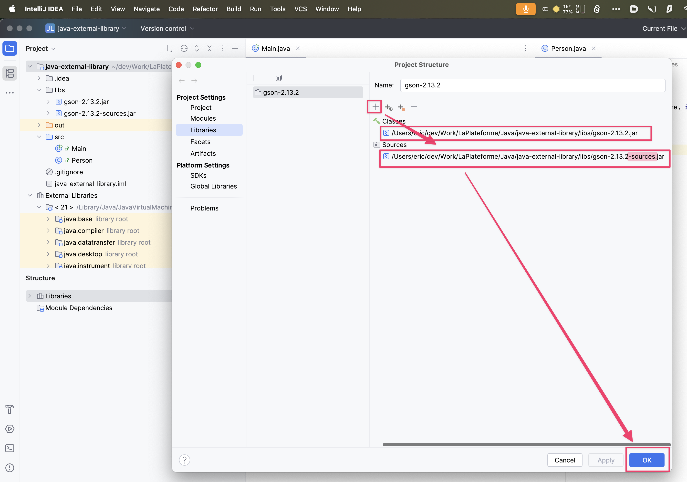

# Using an External Library in a Java Project

This project is aimed at **installing**, 
and **using an external library** in a Java project.

🦕You will do it the old way (once), meaning you will NOT use Maven for this purpose.  
This will give you a grasp of a fraction of what _Maven_ does for us behind the curtain.

To achieve this goal you need to:

- Search for the library
- Install the library locally
- Compile our Java Source Files
- Run the App
- Configure the IDE

For the sake of example we will download, install the **Gson** library.
We will use it to [display/serialize](https://github.com/ebouchut-laplateforme/-java-external-library/blob/e2d6ef61fac1d0f0a03c8f54f6047881d6de880a/src/Main.java#L15) an instance of an object of type <code>Person</code> as **JSON**.

We create a **new Java project**:

- named `java-external-library`
- with the `Build System` set to `IntelliJ` (NOT `Maven`) 
- with the following **folder structure**:
  ```txt
  java-external-library  # The root folder of the project 
    ├── docs             # Documentation
    ├── libs             # Libraries 
    ├── out              # Classes
    └── src              # Sources 
  ```

## Download the Library

An (External) Java library is packaged as a **Jar file**.  
A Jar file is an archive, that is a zip file with a conventional structure).

You can use the **maven repository website** to search for the Gson library:

  https://mvnrepository.com/

- Enter `gson` in the search box and press the `Return` key (`⏎`)
- You should end up on [the Gson page](https://mvnrepository.com/artifact/com.google.code.gson/gson)  
    In the table that lists the versions available: 
    - Click latest version number (eg. today `2.13.2`)
    - In the `Files` section:
      - click `View All` to get a list of all jar files for this version 
        - Click `gson-2.13.2.jar ` to download the jar with the **classes** 
        - Click `gson-2.13.2-sources.jar ` to download the Java **source** files

## Install the Library

Copy the library files `gson-3.12.3.jar` and `gson-3.12.3-sources.jar` 
to your project's `libs/` folder

## Compile the App

```shell
cd $DEV/java-external-library

javac -d out -cp out:libs/gson-2.13.2.jar **/*.java
```

The above command compiles the Java source files under `src/`. 
This saves the generated Java classes (`.class` files) in the `out/` folder.

The value of the **`-cp`** option contains the **classpath**,
that is the folders where to find the classes (`out`) and the path to the library (`libs/gson-2.13.2.jar`).
Classpath entries are separated with a special character:

- On **Linux/macOS**: a colon (`:`) 
- On **Windows**: a semicolon (`;`) 


## Run the App

```shell
java -cp out:libs/gson-2.13.2.jar Main
```

### Configure the IDE

You then configure your Java project in IntelliJ IDEA
to declare where to find this library: 

Of course, we do not even envision to code in Java without an IDE.
Therefore, let's climb the second step, not to do this in a CLI anymore.

> 


This indicates where the IDE will find the Gson library:

- classes in `libs/libs/gson-2.13.2.jar`
- source files in `libs/gson-2.13.2-sources.jar` 
